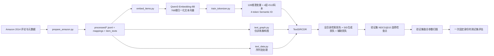

# SIR-CDR Text v4：完整实现说明、结果分析与学术规范审查

> 审查日期：2026-09-23
>
> 审查代码：`b05dd403551133a3e7ce399fd582b7c43d6a5150`（`main`，审查开始时与 `origin/main` 一致）
>
> 实验范围：SIR-CDR Text v4，随机种子 `42`，三个目标方向
>
> 结果来源：远端服务器生成的 `gencdr_three_datasets_seed42.csv` 及本地同提交代码
>
> 结论边界：本文是代码、配置、日志和结果文件审查，不对研究人员主观意图作判断。

## 1. 执行摘要

Text v4 是一个以**冻结文本语义、双域结构图、用户隐式推理、语义 ID 生成和候选重排**为核心的跨域推荐框架。它使用 Qwen3-Embedding-8B 生成物品文本向量，但推荐器本身不是 8B 参数大模型；实际训练主体是隐藏维度为 128 的图编码器、GRU 序列编码器、原型分解模块、门控推理模块、CPF 模块和语义 ID 解码器。

当前三个方向的单次种子结果如下：

| 方向 | R@5 | N@5 | R@10 | N@10 | R@20 | N@20 |
|---|---:|---:|---:|---:|---:|---:|
| Sports → Clothing | 0.010980 | 0.007051 | 0.015948 | 0.008613 | 0.026667 | 0.011298 |
| Phones → Electronics | 0.034644 | 0.022944 | 0.051702 | 0.028428 | 0.071930 | 0.033542 |
| Books → Movies | 0.026358 | 0.017233 | 0.040784 | 0.021879 | 0.062946 | 0.027436 |
| 三方向宏平均 | **0.023994** | **0.015743** | **0.036145** | **0.019640** | — | — |

最重要的审查结论是：

1. **没有发现伪造指标、把测试标签直接用于训练、在当前三数据集总控脚本中用测试集选择融合参数等证据。**
2. **当前结果不能作为与 GenCDR 原表格严格公平的横向比较。** 两者的数据来源、用户构造、方向数量、模型容量和最优检查点标准不同；尤其当前 Books → Movies 使用 Amazon 2014，而 GenCDR 论文中的 Books/Movies 来自 Douban。
3. **当前只有 seed=42。** 可以报告为单次实验或先导结果，不能声称具有统计显著性，也不能把偶然波动描述为稳定优势。
4. **Sports → Clothing 较弱主要由有效训练监督少、目标物品多且异质、每物品监督稀疏、同一套容量与超参数未按数据集适配共同造成。**
5. **R@K 明显高于 N@K 是指标定义导致的正常现象。** 当前每行只有一个正样本，R@K 等于 HR@K；N@K 会按命中排名进行对数折扣，命中集中在靠后名次时差距自然扩大。
6. **存在必须修复的复现性缺陷：`label_smoothing` 被公共配置序列化函数从训练身份中删除。** 它会影响生成损失，却不改变检查点训练签名。当前 v4 p0 配置为 0，因此没有证据表明它改变了这次结果，但今后的平滑实验可能错误复用旧检查点。
7. Sports 测试集的旧版结果曾在 v4 开发前被观察。若后续结构选择受其影响，应明确标记为**先导测试集污染风险**；不能把最终 Sports v4 结果描述成完全未触碰测试集的确认性结果。

---

## 2. Text v4 在仓库中的位置

仓库同时保留了早期推荐器、合成实验和 Text v2/v3/v4 路径。当前三数据集实验实际入口是：

```text
experiments/run_gencdr_benchmarks.py
  ├─ 资产检查：processed 数据 + tokenizer 产物 + Git 身份
  ├─ cdr_framework/text_training.py::train
  │    └─ cdr_framework/text_model.py::TextSIRCDR
  ├─ experiments/sweep_text_fusion.py::sweep（仅 validation）
  ├─ cdr_framework/text_training.py::evaluate_checkpoint（最终 test）
  └─ 汇总 JSON/CSV
```

完整数据链路如下：



Qwen 模型只负责离线编码物品文本。训练 Text v4 时不会反向更新 Qwen3-Embedding-8B，也不会调用 LLaMA-Factory；因此准确表述应为“使用 Qwen3-Embedding-8B 特征的 SIR-CDR”，而不是“微调 Qwen 8B 的生成式推荐器”。

---

## 3. 从原始数据到三组实验资产

### 3.1 原始数据下载与解析

三份数据配置为：

| 方向 | 配置 | 源域 | 目标域 | 当前原始数据来源 |
|---|---|---|---|---|
| Sports → Clothing | `configs/amazon_sports_clothing.yaml` | Sports_and_Outdoors | Clothing_Shoes_and_Jewelry | Amazon 2014 |
| Phones → Electronics | `configs/amazon_phones_electronics.yaml` | Cell_Phones_and_Accessories | Electronics | Amazon 2014 |
| Books → Movies | `configs/amazon_books_movies.yaml` | Books | Movies_and_TV | Amazon 2014 |

`experiments/prepare_amazon.py` 读取配置并调用：

- `cdr_framework/datasets/amazon2014.py`：下载、断点文件处理、gzip JSON 行读取、基本字段解析；
- `cdr_framework/datasets/amazon_preprocessing.py`：域间用户筛选、时间排序、样本构造和文件写出；
- `cdr_framework/datasets/schema.py`：定义配置及持久化数据的字段约束；
- `cdr_framework/datasets/splits.py`：按目标域交互时间执行 train/validation/test 切分。

物品文本由 `title`、`brand`、`categories`、`features`、`description` 拼接，单物品文本截断到 12,000 个字符。缺少元数据的交互会被过滤。

### 3.2 用户和时间切分规则

当前 SIR-CDR 的用户构造具有很强的任务定义含义：

1. 使用两个 Amazon 类别中相同的 `reviewerID` 作为跨域用户；
2. 用户在两个域内都至少有 5 次交互；
3. 目标域最后一次交互为 test，倒数第二次为 validation；
4. 更早的目标域前缀逐步形成训练样本；
5. 对每个目标标签，只允许使用时间戳严格早于标签的源域历史；
6. 目标历史也只包含该标签之前的目标域交互；
7. 空历史样本会被跳过。

这一设计避免了直接把未来交互放入用户序列，但它和 GenCDR 开源实现中的用户命名与联合数据构造不一致，因此两者不是同一实验人口。

### 3.3 处理后数据规模

| 方向 | 训练行 | 验证行 | 测试行 | 源物品 | 目标物品 | 总物品（含 padding） |
|---|---:|---:|---:|---:|---:|---:|
| Sports → Clothing | 19,815 | 3,754 | 3,825 | 13,057 | 13,044 | 26,102 |
| Phones → Electronics | 151,685 | 12,851 | 13,249 | 10,016 | 45,124 | 55,141 |
| Books → Movies | 616,434 | 35,787 | 36,460 | 269,301 | 49,273 | 318,575 |

粗略计算每个目标物品对应的训练行数：

- Sports → Clothing：`19,815 / 13,044 ≈ 1.52`；
- Phones → Electronics：`151,685 / 45,124 ≈ 3.36`；
- Books → Movies：`616,434 / 49,273 ≈ 12.51`。

这个量级差异是理解三个方向性能差异的首要因素。

### 3.4 Qwen3-Embedding-8B 离线嵌入

`experiments/embed_items.py` 调用 `cdr_framework/embeddings/qwen3_local.py`：

- 模型：`Qwen/Qwen3-Embedding-8B`；
- CUDA 上使用 BF16 和 SDPA；
- 左侧 padding，最大序列长度 8192；
- 使用 SentenceTransformers 接口编码；
- 从模型输出截取前 768 维，随后进行 L2 归一化；
- 默认逐物品批处理，并把中间结果分块写入缓存；
- `progress.json` 记录已完成批次数，下载或编码中断后可恢复；
- 最终 `text_embeddings.pt` 的第 0 行作为 padding 零向量。

相关文件职责：

- `embeddings/api.py`：嵌入作业公共协议；
- `embeddings/providers.py`：不同 provider 的创建与选择；
- `embeddings/qwen.py`：Qwen provider 的公共封装；
- `embeddings/qwen3_local.py`：本地 Qwen3 8B 具体实现；
- `embeddings/cache.py`：缓存、进度和身份；
- `embeddings/local.py`：本地模型公共工具；
- `embeddings/__init__.py`：包导出。

### 3.5 可训练语义 tokenizer 与 Semantic ID

`experiments/train_tokenizer.py` 调用 `cdr_framework/tokenization/training.py`。处理顺序是：

1. `TrainableSemanticTokenizer` 把 768 维文本向量压缩到 128 维；
2. 共享分支、域专属分支和门控分支共同产生连续潜变量；
3. 解码器重构原文本向量；
4. 域分类器和门控均衡项提供辅助约束；
5. 训练完成后对潜变量执行 4 层残差 K-means；
6. 每层码本大小为 512，得到长度为 4 的 Semantic ID；
7. 写出潜变量、语义 ID、码本及质量报告。

tokenizer 训练目标由重构损失、域分类损失和门控均衡损失构成。当前日志中域损失接近 0，表示域分类任务很快变得容易；它不能单独证明表示已学到跨域可迁移语义。

输出文件：

- `item_latents.pt`：每个物品的 128 维连续潜变量；
- `semantic_ids.pt`：每个物品的 4 个离散语义 token；
- `tokenizer.pt`：模型状态、4×512×128 码本及训练身份；
- `quality_report.json`：碰撞率、各层码本利用率、量化误差和是否通过门槛。

质量门槛为碰撞率不高于 0.10、每层利用率不低于 0.10。已观察到：

| 方向 | 碰撞率 | 各层利用率 | 量化 MSE | 是否通过 |
|---|---:|---|---:|---|
| Phones → Electronics | 0.035764 | 全部 1.0 | 日志未提供 | 是 |
| Books → Movies | 0.059603 | 全部 1.0 | 0.001522 | 是 |

Sports 的本轮完整质量报告未随当前结果提供，本文不补造数值。

底层文件分别为：`tokenizer.py`（连续表示网络）、`residual_kmeans.py`（逐层量化残差）、`codebook.py`（码本操作）、`item_index.py`（物品与语义 ID 索引）、`training.py`（训练、恢复、质量门控与保存）。

### 3.6 一键资产准备

`experiments/prepare_gencdr_assets.py` 按方向顺序调用：

```text
prepare_amazon.py
  → embed_items.py
  → train_tokenizer.py
```

它会跳过已经完整且身份匹配的阶段。此前 tokenizer 报 `Unknown domain` 的原因是 Amazon 配置中的域名没有进入 tokenizer 的域标签映射；提交 `b05dd40` 修正了配置域标签。

---

## 4. Text v4 模型内部流程

三个 v4 p0 配置采用相同的模型与训练超参数，只替换数据和资产目录：

| 参数组 | 当前值 |
|---|---|
| 表示与图 | `hidden_dim=128`，`graph_layers=2`，`cross_window=5` |
| 序列与推理 | `max_sequence_length=50`，`reasoning_steps=3`，`feedback_steps=2` |
| 生成 | `prefix_length=4`，`beam_size=50`，`decode_chunk_size=256` |
| 优化 | `batch_size=128`，`learning_rate=3e-4`，`weight_decay=1e-4` |
| 训练控制 | `max_epochs=100`，每 2 epoch 验证，`early_stopping_patience=8` |
| 评估 | `evaluation_batch_size=16`，`top_ks=[5,10,20]`，`rerank_candidates=500` |
| 选择 | `selection_metric=NDCG@10`，默认 `inference_mode=hybrid` |

使用统一配置便于控制变量，但不代表这套参数对三个规模差异显著的数据集都最优。

### 4.1 固定目录与输入批次

`cdr_framework/formal_training.py::load_fixed_catalog` 加载 tokenizer 资产，形成固定物品目录。`cdr_framework/text_data.py` 将 JSONL 样本整理为：

- 源域历史序列及长度；
- 目标域历史序列及长度；
- 目标正样本；
- padding mask。

物品文本潜变量、Semantic ID 和码本在 Text v4 中注册为 buffer，不随推荐训练反向更新。

### 4.2 仅用训练集构建双域结构图

`cdr_framework/text_graph.py::build_training_graphs` 只读取 `train.jsonl`。它保留每个用户时间上最新的一条训练样本作为历史快照，并显式排除该行正标签，然后建立：

- 源域相邻转移边；
- 目标域相邻转移边；
- 共享图中的两域边并集；
- 最近 `cross_window=5` 个源物品与目标物品的跨域笛卡尔积边。

边会转为无向、去重、加入自环并执行对称度归一化，最后保存为稀疏 COO 张量。`SparseDualGraphEncoder` 对输入表示聚合 `X`、`AX`、`A²X`，再分别投影成共享、源域私有和目标域私有图表示。

注意：图是训练开始前构建的静态全训练图，并非每个前缀样本独立的因果图。这不构成测试泄漏，但属于需要披露的训练期转导式结构聚合。

### 4.3 内容与语义码表示

`cdr_framework/text_model.py::TextSIRCDR` 将两类静态信息组合：

1. 128 维连续 item latent 经内容投影；
2. 每个物品的 4 个 Semantic ID 在对应码本中查找质心并聚合；
3. 两路结果经 LayerNorm 得到基础 item state；
4. 图编码器在此基础上生成共享和域私有结构状态。

`semantic_enabled=False` 的消融会关闭语义码贡献；`graph_enabled=False` 会关闭图传播。

### 4.4 原型分解与序列编码

`cdr_framework/modules.py::TextPrototypeDisentangler` 把表示分解成：

- shared prototype/token；
- source-private prototype/token；
- target-private prototype/token。

源域和目标域分别使用 GRU 编码序列。打包序列和 mask 确保 padding 不参与递归状态和注意力池化。该掩码是在提交 `fa0b23e` 中补全的，避免 padding 结构信号污染用户表示。

序列尾部通过注意力池化，再由 shared/source/target heads 和 transfer gate 形成初始用户状态。

### 4.5 跨域与域内结构注入

Text v4 使用两种结构信号：

- **CD injector**：让用户状态对源、目标两条历史的结构表示做掩码注意力，提取跨域信号；
- **SP injector**：分别聚合两域结构历史，得到域内共享/私有统计。

`GatedSignalFusion` 将序列私有信号和图私有信号进行可学习门控融合。提交 `efaf7e9` 修复了早期版本中私有序列与图信号没有充分合并的问题。

### 4.6 用户隐式推理与 CPF 反馈

`UserImplicitReasoner` 进行 3 个推理步骤，每步根据当前状态和结构证据更新门控隐状态。随后 `modules_cpf.py` 中的 CPF 模块执行 2 轮预测反馈：上一轮预测经门控映射后重新进入上下文，用于逐步校正用户意图。

这些模块的作用是增加跨域证据交互深度，但它们的容量仍远低于 GenCDR 的 Qwen2.5-7B 解码器与 LoRA 专家系统。

### 4.7 检索头与生成头

模型包含两条打分路径。

**检索路径：**

- 用户状态经 query head 投影并归一化；
- 与全部目标物品表示计算相似度；
- 训练时对完整目标目录计算交叉熵；
- 不使用采样负例。

**生成路径：**

- `CodebookSummaryPool` 从所有码本质心中提取与用户相关的语义摘要；
- `DualStructuralFusionPrefix` 将 shared、private、CD signal、target SP signal、codebook summary 融合成长度 4 的条件前缀；
- GRU 自回归解码 4 个偏移后的 Semantic ID token，最后生成 EOS；
- 训练使用 teacher forcing 和生成交叉熵。

目标物品的 Semantic ID 可能碰撞，因此生成分数本身并不总能唯一确定物品。Text v4 的混合检索与重排正是用连续检索分数补充分辨能力。

### 4.8 总损失

可概括为：

\[
\mathcal{L}=\lambda_r\mathcal{L}_{retrieval}
+\lambda_g\mathcal{L}_{generation}
+\lambda_{cpf}\mathcal{L}_{cpf}
+\lambda_{align}\mathcal{L}_{align}
+\lambda_{sep}\mathcal{L}_{sep}
+\lambda_{lsep}\mathcal{L}_{lsep}
+\lambda_{orth}\mathcal{L}_{proto\_orth}.
\]

v4 p0 配置的主要权重为：检索 1.0、生成 1.0、CPF 0.1、对齐 0.02、分离 0.01、LSEP 0.01、原型正交 0.01。`cdr_framework/losses.py` 实现对比对齐、分离/LSEP 等辅助目标，`modules_cpf.py` 提供 CPF 预测和相关损失。

### 4.9 训练、检查点选择与提前停止

`cdr_framework/text_training.py::train`：

- 固定 Python、PyTorch 和 CUDA 随机种子；
- 每个 epoch 使用 `seed + epoch` 生成数据顺序；
- AdamW，学习率 `3e-4`，权重衰减 `1e-4`；
- 梯度范数裁剪为 5；
- 每 2 个 epoch 在 validation 上评估；
- `ReduceLROnPlateau` 在验证指标停滞时把学习率乘 0.5；
- 以 `NDCG@10` 选择 `best_model.pt`；
- 8 次验证无改进后提前停止；
- `last_checkpoint.pt` 支持恢复；完成后写不可变完成清单。

三个方向最终选中的 epoch 分别为 20、10、18。这里的选择标准与 GenCDR 论文使用 Recall@10 选择检查点不同，比较时必须披露。

### 4.10 验证集融合扫描与最终测试

`experiments/sweep_text_fusion.py` 在 validation 上组合：

- 归一化：`none`、`log_softmax`、`zscore`；
- 生成分数权重：`0, 0.1, 0.25, 0.5, 1, 2`；
- 检索分数权重固定为 1；
- 每次先取检索 Top 500，再计算候选的生成分数。

选择 validation NDCG@10 最高的设置；并列时偏向更小的生成权重。随后 `_evaluate_once()` 把这一固定设置在 test 上运行一次。若 `test_hybrid.json` 已存在但评估身份不同，总控脚本会拒绝覆盖。

测试时先屏蔽目标历史中已见物品，再按下式融合：

\[
s(i)=w_r\,Norm(s_r(i))+w_g\,Norm(s_g(i)).
\]

其中 `s_r` 是连续检索分数，`s_g` 是候选 Semantic ID 序列的平均对数概率。Top 500 是两阶段排序的候选上限：若真正正样本没有进入检索 Top 500，生成分支无法把它救回。

---

## 5. 三数据集总控脚本如何运行

### 5.1 资产预检

```bash
python experiments/run_gencdr_benchmarks.py --action preflight
```

预检执行以下约束：

- 当前 Git HEAD 与 upstream 一致；
- 受跟踪文件干净；
- 三组 `mappings.json`、train/validation/test JSONL 存在；
- tokenizer 四类资产存在；
- tokenizer schema 为 v2；
- 质量报告 `passed=true`；
- 目标域、物品数量和张量形状互相一致。

### 5.2 完整训练与评估

```bash
python -u experiments/run_gencdr_benchmarks.py \
  --action all \
  --device cuda \
  --seed 42
```

脚本按配置表顺序先完成三个方向的训练，再逐个执行验证融合扫描和测试。汇总文件写到：

```text
artifacts/text_cdr_v4/benchmark_reports/
  gencdr_three_datasets_seed42.json
  gencdr_three_datasets_seed42.csv
```

### 5.3 只重新汇总

```bash
python experiments/run_gencdr_benchmarks.py --action summarize --seed 42
```

它只读取已有测试结果，不重新训练或评估。

---

## 6. 文件级说明

### 6.1 Text v4 核心文件

| 文件 | 是否直接运行 | 作用 |
|---|---|---|
| `cdr_framework/text_config.py` | 否 | `TextCDRConfig`、参数校验、YAML 加载；区分模型、训练和推理参数。 |
| `cdr_framework/text_data.py` | 否 | 读取 JSONL、构造 Dataset、padding 与序列 mask。 |
| `cdr_framework/text_graph.py` | 否 | 仅从训练集构建 shared/source/target 稀疏图，执行图传播。 |
| `cdr_framework/text_model.py` | 否 | 定义 `TextSIRCDR`，串联内容、语义、图、原型、GRU、推理、CPF、检索和生成。 |
| `cdr_framework/text_training.py` | 否 | v4 训练、恢复、验证、检查点身份、评估身份和指标文件写出。 |
| `cdr_framework/modules.py` | 否 | 原型分解、结构注入、门控融合、隐式推理、码本摘要和前缀融合。 |
| `cdr_framework/modules_cpf.py` | 否 | CPF 预测、反馈与辅助损失。 |
| `cdr_framework/losses.py` | 否 | 对齐、正交、分离和 LSEP 等辅助损失。 |
| `cdr_framework/ops.py` | 否 | 掩码 softmax、归一化和张量公共操作。 |
| `cdr_framework/catalog_generation.py` | 否 | 目录 Semantic ID trie、约束 beam search 和生成候选工具。 |
| `cdr_framework/metrics.py` | 否 | HR/Recall、NDCG、MRR、coverage 的通用实现。 |
| `cdr_framework/formal_training.py` | 否 | 加载固定目录、原子保存、哈希与公共配置身份函数。 |
| `cdr_framework/formal_recommendation.py` | 否 | 早期正式推荐路径、目录对象和推荐数据公共组件；部分工具被 Text v4 复用。 |

库文件不应逐个从命令行启动；它们由 `experiments/` 下的入口调用。

### 6.2 数据、嵌入和 tokenizer 文件

| 文件 | 作用 |
|---|---|
| `datasets/amazon2014.py` | Amazon 2014 下载与流式解析。 |
| `datasets/amazon_preprocessing.py` | 用户筛选、文本拼接、时间前缀样本和落盘。 |
| `datasets/schema.py` | 数据配置和输出 schema。 |
| `datasets/splits.py` | 时间顺序切分。 |
| `embeddings/api.py` | 嵌入 provider 接口。 |
| `embeddings/cache.py` | 分块缓存、进度和恢复。 |
| `embeddings/local.py` | 本地模型公共加载逻辑。 |
| `embeddings/providers.py` | provider 注册与选择。 |
| `embeddings/qwen.py` | Qwen 嵌入封装。 |
| `embeddings/qwen3_local.py` | Qwen3-Embedding-8B 本地 BF16 编码、MRL 截断和归一化。 |
| `tokenization/tokenizer.py` | 可训练共享/私有/门控连续 tokenizer。 |
| `tokenization/residual_kmeans.py` | 4 层残差 K-means。 |
| `tokenization/codebook.py` | 码本量化和查找。 |
| `tokenization/item_index.py` | 物品与 SID 映射。 |
| `tokenization/training.py` | tokenizer 训练、恢复、质量报告和资产导出。 |

### 6.3 实验入口

| 文件 | 典型运行方式 | 说明 |
|---|---|---|
| `prepare_amazon.py` | `python experiments/prepare_amazon.py --config ...` | 下载并预处理一个域对。 |
| `embed_items.py` | `python experiments/embed_items.py --config ... --device cuda` | 为一个域对生成 Qwen 向量。 |
| `train_tokenizer.py` | `python experiments/train_tokenizer.py --config ... --device cuda` | 训练 tokenizer 并生成 SID。 |
| `prepare_gencdr_assets.py` | `python experiments/prepare_gencdr_assets.py --pairs ... --device cuda` | 顺序编排三阶段资产准备。 |
| `run_text_cdr.py` | `python experiments/run_text_cdr.py --config ... --action train/evaluate` | 单配置训练或评估。 |
| `sweep_text_fusion.py` | 通常由总控脚本调用 | 在验证集扫描融合归一化与权重。 |
| `run_gencdr_benchmarks.py` | `--action preflight/all/summarize` | 三方向总控、不可变测试和汇总。 |
| `summarize_text_cdr.py` | 直接运行 | 汇总单方向或旧实验结果。 |
| `diagnose_recommender.py` | 直接运行并指定配置 | 诊断热门度、候选和检查点行为。 |
| `sweep_reranking.py` | 直接运行并指定配置 | 早期正式推荐器的重排扫描。 |
| `train_recommender.py` | 指定 Amazon 配置 | 早期 formal recommender 训练入口，不是 Text v4 主线。 |
| `evaluate_recommender.py` | 指定配置与 split | 早期 formal recommender 评估入口。 |
| `run_synthetic.py` | 直接运行 | 合成数据框架检查，不产生当前三数据集指标。 |

### 6.4 配置文件

- `amazon_*.yaml`：原始文件 URL、域名、过滤、嵌入和 tokenizer 参数；
- `text_*_v4_p0.yaml`：三方向当前正式 Text v4 配置；
- `text_sports_clothing.yaml`：早期/兼容主配置；
- `text_sports_clothing_l2a/l2b/l3a/l4b...l4f.yaml`：历史消融和改进阶段配置，用于追踪超参数尝试，不应混作当前三个方向的统一正式配置。

### 6.5 旧框架与兼容文件

`cdr_framework/adapters.py`、`codebook.py`、`config.py`、`data.py`、`framework.py`、`graphs/builders.py`、`graphs/confidence.py`、`experiment_config.py` 主要服务早期合成框架或 formal recommender。它们仍由部分测试与公共加载逻辑使用，但不是 Text v4 的主模型实现。阅读仓库时必须区分这些路径，避免把早期类的行为错误归因于 `TextSIRCDR`。

### 6.6 测试文件覆盖范围

测试统一运行方式：

```bash
python -m unittest discover -s tests -v
```

单文件可用 `-p` 筛选，例如：

```bash
python -m unittest discover -s tests -p 'test_text_pipeline.py' -v
```

| 测试文件 | 主要覆盖内容 |
|---|---|
| `test_amazon_preprocessing.py` | 双域用户筛选、时间前缀和处理后文件。 |
| `test_amazon2014_io.py` | 下载、gzip JSON 行和原始文件 IO。 |
| `test_catalog_generation.py` | SID trie、约束生成和目录候选。 |
| `test_checkpoint_identity.py` | 训练/选择/评估身份分层与代码漂移。 |
| `test_codebook.py` | 早期码本公共实现。 |
| `test_config_metrics.py` | 配置校验与 HR/NDCG/MRR/coverage。 |
| `test_cpf.py` | CPF 前向、反馈和损失。 |
| `test_dataset_schemas.py` | 配置和处理后 schema。 |
| `test_embedding_providers.py` | provider 选择和嵌入接口。 |
| `test_experiment_config.py` | formal recommender 配置。 |
| `test_formal_recommendation.py` | 固定目录推荐与候选重排。 |
| `test_formal_training.py` | 早期正式训练、恢复与身份。 |
| `test_framework_forward.py` | 早期框架前向传播。 |
| `test_gencdr_benchmarks.py` | 三方向预检、选择、一次测试和汇总。 |
| `test_graph_features.py` | 图构造、置信度和结构特征。 |
| `test_modules.py` | 原型、推理和融合模块。 |
| `test_package_exports.py` | 包公开 API。 |
| `test_prepare_amazon_cli.py` | Amazon 准备 CLI。 |
| `test_prepare_gencdr_assets.py` | 三阶段资产编排与恢复。 |
| `test_qwen_embedding_job.py` | Qwen 分块、缓存、恢复和输出身份。 |
| `test_recommendation_diagnostics.py` | 诊断脚本输出。 |
| `test_reranking_sweep.py` | 早期重排扫描。 |
| `test_residual_kmeans.py` | 多层残差量化。 |
| `test_text_fusion_sweep.py` | validation 融合扫描和选择规则。 |
| `test_text_graph.py` | 仅训练图、跨域边和稀疏编码。 |
| `test_text_pipeline.py` | Text 训练/评估主链路。 |
| `test_text_structural.py` | Text v4 结构模块和消融。 |
| `test_tokenization_boundary.py` | tokenizer 资产边界与物品索引。 |
| `test_tokenizer_training.py` | tokenizer 训练、恢复和质量门槛。 |

测试证明代码约束按设计执行，但不证明论文比较公平，也不能替代多随机种子统计检验。

各目录的 `__init__.py` 仅负责把稳定接口导出为 Python 包，不作为命令行入口运行。

---

## 7. 到目前为止用于提升指标的方法

从提交历史和当前实现可以归纳为七类。

### 7.1 更强的文本语义底座

- 用 Qwen3-Embedding-8B 替换弱文本表示；
- 使用 768 维归一化 MRL 向量作为离线语义；
- 通过可训练 tokenizer 压缩为适合推荐模型的 128 维 latent；
- 用残差 K-means 生成层次 Semantic ID。

### 7.2 共享与私有结构建模

- 分离 shared/source-private/target-private 表示；
- 构建源、目标和跨域共享图；
- 加入 CD 与 SP 两类结构注入；
- 修复 padding mask；
- 使用门控融合序列私有和图私有信号。

### 7.3 多步用户推理

- reasoning steps 从单步扩展到 3 步；
- CPF 进行 2 轮预测反馈；
- 加入 transfer gate 控制源域知识注入强度。

### 7.4 检索与语义生成联合学习

- 完整目标目录交叉熵，避免采样负例带来的目标偏差；
- 生成 Semantic ID 的自回归损失；
- 码本摘要和双结构前缀把离散语义与用户状态连接起来；
- 训练损失权重与推理排序权重分离，避免混用两个概念。

### 7.5 辅助约束

- shared 表示对齐；
- shared/private 分离和原型正交；
- LSEP 排序/分离约束；
- CPF 辅助预测；
- 历史实验尝试过 label smoothing 以降低生成过度置信和热门度坍缩。

### 7.6 推理阶段校准

- 将候选数扩大到 500；
- 检索与生成分数分别做 `none/log_softmax/zscore` 校准；
- 在 validation 上扫描生成权重；
- 对训练身份和评估身份分层记录，允许只改变排序参数而不冒充重新训练。

### 7.7 实验完整性工程

- 原子保存和断点恢复；
- 资产哈希、代码哈希和 checkpoint SHA256；
- preflight 要求 Git 与 upstream 一致且工作区干净；
- 测试结果身份不一致时拒绝由总控脚本覆盖；
- 先 validation 选融合参数，再固定参数测试。

这些措施中，前六类可能直接影响推荐指标；第七类主要提高复现性和可信度，不应被描述为“涨点技巧”。

---

## 8. 当前结果与 R/N 差距

### 8.1 完整单种子测试结果

| 方向 | epoch | R@5 | N@5 | R@10 | N@10 | MRR@10 | coverage | 测试样本 |
|---|---:|---:|---:|---:|---:|---:|---:|---:|
| Sports → Clothing | 20 | 0.010980 | 0.007051 | 0.015948 | 0.008613 | 0.006388 | 0.511193 | 3,825 |
| Phones → Electronics | 10 | 0.034644 | 0.022944 | 0.051702 | 0.028428 | 0.021323 | 0.150785 | 13,249 |
| Books → Movies | 18 | 0.026358 | 0.017233 | 0.040784 | 0.021879 | 0.016155 | 0.445599 | 36,460 |

### 8.2 为什么 R@K 等于 HR@K

当前每个评估样本只有一个目标正物品，因此：

\[
Recall@K=HitRate@K=\mathbb{1}(rank\le K).
\]

代码同时输出 `R@K` 与 `HR@K` 是为兼容不同论文命名，不代表计算了两种不同召回。

### 8.3 为什么 N@K 明显更低

单正样本下：

\[
NDCG@K=\begin{cases}
1/\log_2(rank+1),& rank\le K\\
0,& rank>K.
\end{cases}
\]

Recall 只判断是否进入前 K；NDCG 还惩罚靠后命中。例如同样命中 Top 10：第 1 名贡献 1，第 5 名约 0.387，第 10 名约 0.289。因此 N@K 小于 R@K 完全符合定义。

| 方向 | N@5 / R@5 | N@10 / R@10 | Top-10 命中中位于 6–10 的比例 |
|---|---:|---:|---:|
| Sports → Clothing | 0.642 | 0.540 | 31.1% |
| Phones → Electronics | 0.662 | 0.550 | 33.0% |
| Books → Movies | 0.654 | 0.536 | 35.4% |

三个方向的比率非常接近，说明 R/N 差距是稳定的排名分布特征，而不是某个数据集的异常计算。Top-10 命中中约三分之一发生在第 6–10 名，这些命中对 Recall 贡献 1，却只给 NDCG 贡献约 0.29–0.36。其余 Top-5 命中也不都在第 1 名，因此 NDCG 继续低于 Recall。

如果希望提高 N@K，仅扩大候选覆盖或提高 R@K 不够；必须让已能召回的正物品继续向榜首移动。可优先分析正样本在 retrieval Top 500 中的原始排名、融合后排名变化、Semantic ID 碰撞组大小和热门度分桶。

---

## 9. 为什么 Sports → Clothing 明显更弱

### 9.1 监督密度不足

Sports 只有 19,815 个训练前缀，分别约为 Phones 的 13.1%、Books 的 3.2%。每个目标物品只有约 1.52 条训练行。模型要在 13,044 个 Clothing 目标物品中分类，很多物品只能获得极少监督。

### 9.2 目标域异质性高

Clothing_Shoes_and_Jewelry 同时覆盖服装、鞋和珠宝，标题与描述中的通用词很多，文本相近不等于行为可替代。Qwen 语义能够找到内容相近物品，但最终需要预测用户下一次交互；弱行为监督下，语义相似很容易停留在“同类但不是正确物品”。

### 9.3 固定容量和统一超参数不一定适配小数据

三方向使用同一 hidden size、图层数、辅助损失权重、候选数和训练规则。统一配置有利于控制变量，但 3 个推理步骤、多路原型和多个辅助损失对 Sports 可能过复杂。它没有足够数据稳定估计门控、图私有信号和生成器。

### 9.4 验证集较小，模型和融合选择更易波动

Sports 验证样本只有 3,754。总控流程在这个验证集上先选择 epoch，又从 18 个融合组合中选最优设置。流程没有使用测试标签，但小验证集会增加选择方差和验证过拟合概率。

### 9.5 Top-500 候选瓶颈

生成分支只重排检索 Top 500。若稀疏 Sports 模型没有把正样本送入候选，结构推理和 SID 生成都无法恢复。应增加一个 validation/test 诊断指标：`candidate_recall@500`。在它不足时继续调融合权重不会解决根因。

### 9.6 Books 与 Phones 为什么在 SIR 内部更好

- Phones 有 7.66 倍于 Sports 的训练行，电子产品标题中的品牌、型号和规格通常与下一物品选择更直接相关；
- Books 有 31.1 倍训练行，每个 Movies 目标物品的监督密度最高；
- 更大的用户/前缀规模使图边、GRU、原型和门控参数更稳定；
- Books 的高 coverage 表明模型覆盖较广，Phones 的较低 coverage 则可能借助集中热门度获得更高准确率。

“Books 比 Sports 好”只适用于当前 SIR 三组 Amazon 任务。它并不意味着 Books → Movies 已接近 GenCDR：当前 SIR 的 R@10 为 0.0408，而 GenCDR 表中 Movies 为 0.1971，且数据来源不同。

---

## 10. 与 GenCDR 的可比性审查

### 10.1 原论文报告值与当前 SIR 值

| 目标域 | GenCDR R@5 | GenCDR N@5 | GenCDR R@10 | GenCDR N@10 | 当前 SIR R@5 | 当前 SIR N@5 | 当前 SIR R@10 | 当前 SIR N@10 |
|---|---:|---:|---:|---:|---:|---:|---:|---:|
| Clothing | 0.0181 | 0.0167 | 0.0265 | 0.0203 | 0.0110 | 0.0071 | 0.0159 | 0.0086 |
| Electronics | 0.0241 | 0.0235 | 0.0342 | 0.0283 | 0.0346 | 0.0229 | 0.0517 | 0.0284 |
| Movies | 0.1713 | 0.1215 | 0.1971 | 0.1275 | 0.0264 | 0.0172 | 0.0408 | 0.0219 |

该表只能展示数值位置，不能据此计算“相对提升”或宣称模型优劣。

### 10.2 数据和用户定义不同

GenCDR 论文前两组使用 Amazon，Books/Movies 使用 Douban。当前 SIR 三组全部来自 Amazon 2014。原 GenCDR 数据规模和重叠用户比例也与当前预处理结果不同。

更关键的是，当前 SIR 要求同一 `reviewerID` 同时出现在两个 Amazon 域并在两域均满足最少交互；GenCDR 开源数据构造对用户使用域前缀命名，其联合样本机制并不等于当前的严格交集用户。因此即使域名相同，样本人口、历史长度和目标难度也不同。

### 10.3 方向数量不同

GenCDR 表格报告 Sports、Clothing、Phones、Electronics、Books、Movies 六个目标方向。当前总控只运行：

- Sports → Clothing；
- Phones → Electronics；
- Books → Movies。

缺少反向 Clothing → Sports、Electronics → Phones、Movies → Books。当前结果应称为“三个定向任务”，不应称为“完整复现 GenCDR 六场景”。

### 10.4 架构容量不同

GenCDR 使用 Qwen2.5-7B 生成模型、通用与域 LoRA 专家、用户路由/VIB 和域前缀树。SIR-CDR 使用冻结 Qwen3 嵌入，加上 128 维 GRU、图编码器、隐式推理和小型 SID 解码器。两者可以对齐数据、SID 和评价协议，但不应声称架构等同。

### 10.5 选择规则不同

GenCDR 论文描述以 Recall@10 选择最佳模型；当前 SIR 用 NDCG@10。选择目标不同会改变 epoch 和最终 R/N 权衡。

### 10.6 可接受的论文表述

可写：

> 我们在三个与 GenCDR 域名称对应、但按 SIR-CDR 协议重新构造的定向任务上报告单种子先导结果。由于 Books/Movies 数据源、用户构造和模型选择协议不同，GenCDR 原论文数值仅作背景参照，不构成严格直接比较。

不可写：

> SIR-CDR 在 GenCDR 相同数据集上超过 GenCDR。

除非重新取得同一处理后数据、同一六方向划分、同一候选目录、同一 checkpoint 标准和多种子评估，否则后一表述没有证据支持。

---

## 11. 学术规范与严谨性审查

### 11.1 已通过或有明确防护的项目

| 检查项 | 结论 | 依据 |
|---|---|---|
| 时间切分 | 通过 | 目标域末次 test、倒数第二次 validation，历史严格早于标签。 |
| 直接测试标签进入训练 | 未发现 | 训练加载 train；图也只读取 train，并排除正标签。 |
| 候选目录评估 | 通过 | 对完整目标目录检索并屏蔽已见目标物品。 |
| 检查点选择 | 通过 | validation NDCG@10，不以 test 选择 epoch。 |
| 融合参数选择 | 通过 | 3×6 组合只在 validation 扫描。 |
| 当前总控中的重复试测 | 有防护 | `_evaluate_once` 要求既有测试文件与精确评估身份一致。 |
| 代码与资产追踪 | 较强 | Git preflight、代码哈希、资产指纹、checkpoint SHA256。 |
| 指标伪造 | 未发现证据 | 指标由代码输出、CSV 与日志对应，数值满足 R/HR 和 NDCG 数学关系。 |

### 11.2 高优先级问题

#### A. 不能声称与 GenCDR 严格公平比较

严重度：**高**。

数据来源、用户定义、方向数量、选择指标和模型容量均不一致。若把当前结果直接追加到 GenCDR 原论文表格并标为同协议比较，会造成读者误解。推荐单独建表，并在表题和脚注明确写“reconstructed SIR-CDR protocol; not directly comparable”。

#### B. 单随机种子不足

严重度：**高**。

当前只有 seed 42。不能报告显著性、稳定提升或均值优势。至少应运行 3–5 个预先指定种子，报告均值、标准差和每个种子的原始结果；模型/融合选择必须在每个种子的 validation 内独立完成。

#### C. Sports 测试集曾被观察

严重度：**高，属于确认性结论风险**。

项目历史中已经查看过 Sports 的 v3 test 指标，之后继续开发 v4。即使没有把 test 输入自动调参，只要结构或超参数决策受该结果影响，Sports test 就不再是完全未触碰的确认集。规范做法是：

1. 在论文中披露 Sports test 曾用于先导诊断；
2. 将当前 Sports 结果标为 exploratory/pilot；
3. 冻结方法后，用未观察的新划分或独立数据作最终确认；
4. 后续禁止根据 test 指标继续选择结构、损失或权重。

这项风险本身不等于学术不端；隐瞒并把它描述为完全盲测才会构成严重的报告问题。

#### D. `label_smoothing` 未进入训练身份

严重度：**高，复现性缺陷**。

`text_model.py` 用 `config.label_smoothing` 计算生成交叉熵，但 `formal_training.py::_config_payload` 明确删除该字段；`text_training.py::_training_config_payload` 建立在该结果之上。因此平滑值变化不会触发训练身份不匹配。

当前 v4 p0 是 0，没有证据表明本轮三方向结果复用了不同平滑值的检查点。仍应在未来实验前修复：Text v4 自己构造训练身份时必须显式加入 `label_smoothing`，并升级 schema/version，避免旧检查点静默兼容。

### 11.3 中优先级风险

| 风险 | 影响 | 建议 |
|---|---|---|
| 18 个融合组合共用一个 validation | 增加验证过拟合概率 | 预注册网格；多种子；条件允许时增加 calibration split。 |
| Top-500 预筛 | 生成器无法恢复候选外正样本 | 报告 candidate recall@500；在验证集比较 500/1000/全量。 |
| tokenizer 使用全物品文本 | 属于转导式侧信息，包含未来才交互的物品元数据 | 明确披露；若研究冷启动/归纳设置，另做 train-item-only tokenizer。 |
| 5-core/交集筛选看完整时间线 | 用户资格利用全局统计 | 作为标准预处理披露；严格时序设置中做仅训练期筛选敏感性实验。 |
| 静态训练图 | 一个用户的较晚训练历史可为其较早训练前缀提供结构邻接 | 明确称为训练期转导图；增加逐前缀因果图消融。 |
| `--allow-code-mismatch` | 可绕过代码哈希层 | 当前总控未使用；任何使用都必须记录代码 diff 和理由。 |
| 单配置覆盖三个规模差异很大的任务 | Sports 可能欠拟合或受辅助损失干扰 | 只在 validation 上进行按数据集调参，并完整报告搜索空间。 |
| `evaluate_checkpoint` 可被单独调用 | 绕过总控时可能覆盖同名测试结果 | 把 `_evaluate_once` 的不可变检查下沉到公共评估函数。 |

### 11.4 是否存在学术不端

基于当前可见代码、配置、提交历史和服务器输出：

- **没有证据证明存在捏造、篡改指标或直接把测试标签用于训练。**
- **没有证据证明三数据集总控在测试集上选择融合权重。**
- **存在会导致不严谨或误导性结论的风险，但风险不等于已经发生主观故意的不端。**

以下行为如果发生，将越过学术规范边界：

1. 明知数据与协议不一致，仍把当前行放进 GenCDR 原表并称为同设置公平比较；
2. 隐瞒 Books/Movies 从 Douban 变为 Amazon；
3. 多次查看 test 后继续调参，只挑最好的一次报告；
4. 只报告 seed 42，却声称显著或稳定优于基线；
5. 选择性省略失败方向、失败种子或不利指标；
6. 使用 `--allow-code-mismatch` 后不保存实际代码版本和差异。

因此，当前最准确的审查结论是：**实验工程具有多项良好防护，未发现直接作弊证据；但比较口径、单种子、Sports 先导测试污染和训练身份缺陷必须在正式论文前处理。**

---

## 12. 下一阶段的严谨改进顺序

### P0：先修实验身份和报告口径

1. 将 `label_smoothing` 纳入 Text v4 训练身份并升级版本；
2. 将测试文件不可变检查下沉到公共评估函数；
3. 把实验命名从“GenCDR three datasets reproduction”改为更准确的“SIR-CDR three directed benchmark tasks”；
4. 在所有结果表脚注标明 Amazon/Douban、用户筛选、方向和 checkpoint 标准差异。

### P1：建立可信统计结果

1. 冻结代码与超参数搜索空间；
2. 运行至少 3–5 个种子；
3. 报告 mean ± std、每个种子结果和失败运行；
4. 对预先指定的主要指标做配对统计检验；
5. 为曾观察过的 Sports 测试集建立新的确认性划分或独立复验集。

### P2：定位 Sports 性能瓶颈

按顺序增加诊断，避免盲目调参：

1. retrieval candidate recall@100/500/1000；
2. 正样本的 retrieval rank 与 fusion rank 分布；
3. 目标物品训练频次分桶的 R/N；
4. SID 碰撞组大小分桶的 R/N；
5. 仅 retrieval、仅 generation、hybrid 的配对差异；
6. 图/原型/CPF/推理步骤的验证集消融；
7. 小数据正则、hidden size 和辅助损失权重只在 validation 上搜索。

### P3：实现真正可比的 GenCDR 对照

若目标是发表“与 GenCDR 公平比较”，需要：

1. 使用 GenCDR 完全相同的处理后数据或公开划分；
2. 同时运行六个目标方向；
3. 统一候选集合、已见物品屏蔽和指标实现；
4. 统一最佳检查点标准；
5. 同一随机种子列表、相同重复次数和统计方法；
6. 在附录中同时报告模型容量、训练算力和推理开销。

---

## 13. 最终判断

Text v4 已形成一条完整、可运行且具有较强工程追踪能力的推荐链路：Amazon 时间序列预处理 → Qwen3 文本嵌入 → 域自适应 tokenizer → 层次 Semantic ID → 双域稀疏图 → 原型/序列/结构融合 → 多步隐式推理与 CPF → 全目录检索和 SID 生成 → validation 校准 → 固定身份 test。

它当前最有价值的技术特征是：在不把 SIR-CDR 改造成 GenCDR 的前提下，把语义 ID、结构迁移、用户推理和混合排序结合起来。Phones 与 Books 相对 Sports 的提升主要来自更多、更密的行为监督，而 R 与 N 的差距主要来自排名折扣，不是指标错误。

正式研究结论必须保守：当前结果是三个重新构造的 SIR-CDR 定向任务、单种子先导实验。它们不能直接证明超过 GenCDR，也不能替代同数据同协议的复现实验。完成 P0/P1 后，才适合把结果作为正式实验主表；完成 P3 后，才适合对 GenCDR 作严格优劣判断。

## 14. 审查材料索引

- 本仓库入口与配置：`README.md`、`experiments/run_gencdr_benchmarks.py`、`configs/text_*_v4_p0.yaml`；
- 本仓库实现：`cdr_framework/text_*.py`、`cdr_framework/modules*.py`、`cdr_framework/datasets/`、`cdr_framework/embeddings/`、`cdr_framework/tokenization/`；
- 本仓库既有预处理说明：`docs/amazon_sports_clothing_preprocessing.md`；
- GenCDR 论文：本地 `GenCCDR.pdf`；
- GenCDR 代码副本：本地 `GenCDRfuxian/`；
- 当前指标：远端 `artifacts/text_cdr_v4/benchmark_reports/gencdr_three_datasets_seed42.csv`。

原始训练资产和服务器 `artifacts/` 没有纳入当前 Git 仓库。本文对结果文件的审查以用户提供的服务器输出为依据；若用于论文归档，应同时保存 summary JSON/CSV、三个 `test_hybrid.json`、三个 `selected_validation_setting.json`、训练日志、配置、checkpoint SHA256 和最终 Git bundle/tag。
